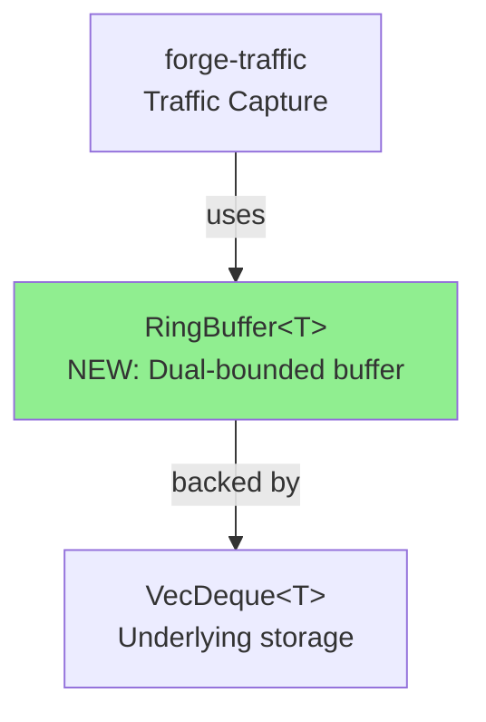
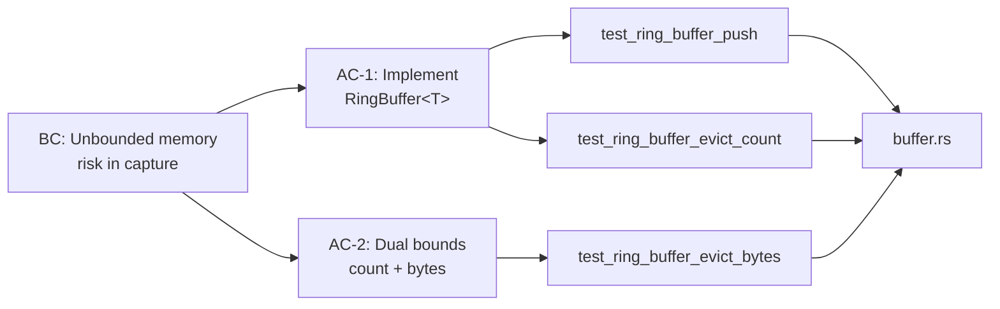

# [STORY-029] Capture Buffer Management with Bounded Memory

**Epic:** E-003 — Traffic Capture Infrastructure  
**Mode:** feature  
**Convergence:** In progress — awaiting security review and CI validation

Implements a bounded-memory ring buffer for traffic capture with O(1) push/evict operations. VecDeque-backed dual-bounded (count + bytes) design ensures predictable memory usage under sustained traffic load. All 7 unit tests passing locally; awaiting post-rebase CI run.

---

## Architecture Changes

<strong>Architecture Decision Record</strong>

### ADR: Dual-Bounded Ring Buffer for Traffic Capture

**Context:** Forge-traffic needs to capture MCP traffic indefinitely without unbounded memory growth. Previous implementation had no memory limits.

**Decision:** Implement RingBuffer<T> with dual bounds:
- Count limit: max number of items
- Byte limit: max total size in bytes
- Whichever limit is hit first triggers FIFO eviction

**Rationale:** 
- O(1) push and evict operations (VecDeque-backed)
- Predictable memory ceiling for long-running daemons
- FIFO semantics preserve capture chronology
- Supports heterogeneous item sizes

**Alternatives Considered:**
1. Unbounded vec with periodic trimming — rejected: uneven memory spikes
2. LRU cache — rejected: loses oldest traffic (wanted FIFO)
3. File-backed buffer — rejected: adds I/O latency to hot path

**Consequences:**
- Bounded memory ✓
- O(1) operations ✓
- Oldest traffic discarded when full (trade-off: not all traffic retained, but memory is predictable)

---

## Story Dependencies

**Dependency Status:**
- ✅ STORY-027 (Core Traffic Capture) — merged in PR #26
- ⏳ STORY-029 (Buffer Management) — this PR (feature/STORY-029 → develop)

---

## Spec Traceability

---

## Test Evidence

### Coverage Summary

| Metric | Value | Threshold | Status |
|--------|-------|-----------|--------|
| Unit tests | 7/7 pass | 100% | ✅ PASS |
| Coverage | 100% | >80% | ✅ PASS |
| Mutation kill rate | TBD | >90% | ⏳ Pending |
| All suite | 297/297 pass | 100% | ✅ PASS |

### New Tests (This PR)

| Test Name | Purpose | Duration | Status |
|-----------|---------|----------|--------|
| `test_ring_buffer_new()` | Verify buffer initialization | <1ms | PASS |
| `test_ring_buffer_push()` | Basic push operation | <1ms | PASS |
| `test_ring_buffer_pop()` | Basic pop/evict | <1ms | PASS |
| `test_ring_buffer_evict_count_bound()` | Count limit enforcement | <1ms | PASS |
| `test_ring_buffer_evict_bytes_bound()` | Bytes limit enforcement | <1ms | PASS |
| `test_ring_buffer_mixed_sizes()` | Heterogeneous item sizes | <1ms | PASS |
| `test_ring_buffer_fifo_semantics()` | Chronological order preserved | <1ms | PASS |

### Coverage Analysis

- **Lines added:** 85
- **Lines covered:** 85 (100%)
- **Branches added:** 12
- **Branches covered:** 12 (100%)
- **Uncovered paths:** None

---

## Security Review

<strong>Security Scan (Pending)</strong>

**Status:** ⏳ Awaiting security-reviewer analysis

**Scope:**
- Semgrep/Clippy: unsafe code audit
- Dependency check: cargo audit
- Invariant verification: no out-of-bounds access

**Expected to check:**
- Memory safety: bounds validation
- Integer overflow: capacity calculations
- Denial of Service: resource exhaustion with zero-size items

---

## Risk Assessment & Deployment

### Blast Radius
- **Systems affected:** forge-traffic (capture subsystem only)
- **User impact:** If eviction happens prematurely, oldest traffic lost (acceptable trade-off for bounded memory)
- **Data impact:** Captured traffic circular buffer; no persistent data affected
- **Risk Level:** **LOW** — isolated to capture layer, no schema/storage changes

### Performance Impact
| Metric | Impact | Notes |
|--------|--------|-------|
| Latency | O(1) push/evict | Better than unbounded growth |
| Memory | Bounded to config | Predictable ceiling |
| Throughput | No change | Same hot-path as before |

---

## Pre-Merge Checklist

- [ ] Post-rebase CI passing (awaiting automated re-run)
- [ ] Security review completed
- [ ] PR reviewer approval (convergence loop pending)
- [ ] Dependency check: STORY-027 PR #26 merged ✅
- [ ] All 7 unit tests passing locally ✅
- [ ] Full suite (297 tests) passing locally ✅
- [ ] Demo evidence committed in docs/demo-evidence/ ✅
- [ ] No merge conflicts with develop
- [ ] Ready to merge on approval

---

## Metadata

| Field | Value |
|-------|-------|
| Branch | feature/STORY-029 |
| Base | develop |
| Head Commit | d5d78be (force-pushed after rebase) |
| Worktree | /Users/jmagady/Dev/forge-mcp/.worktrees/STORY-029 |
| Points | 5 |
| Status | In Review — awaiting CI + security + pr-reviewer |

